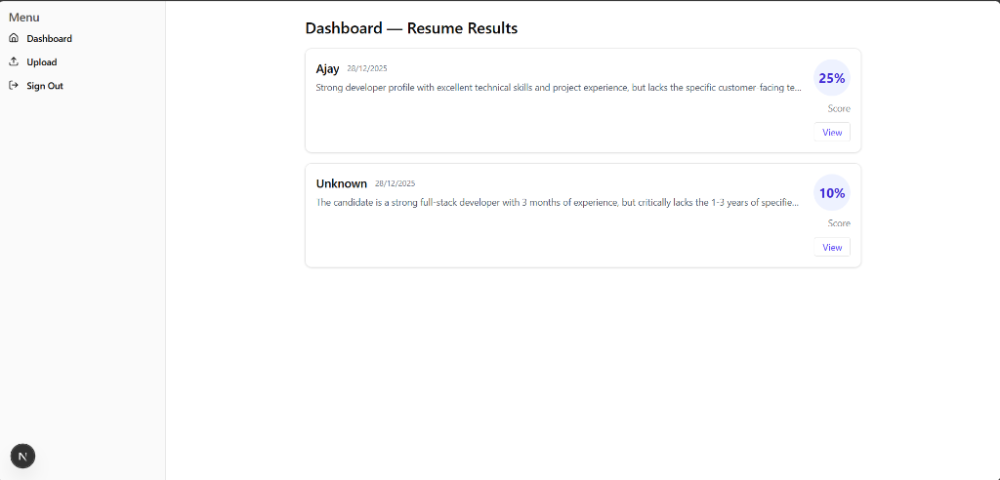
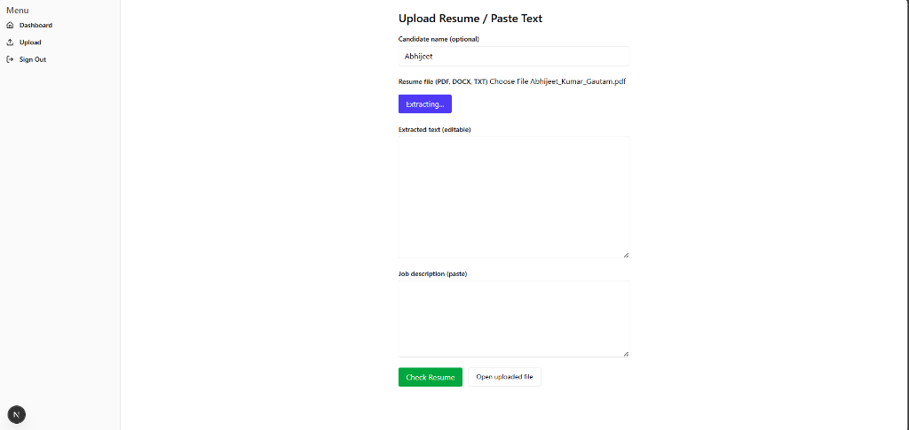
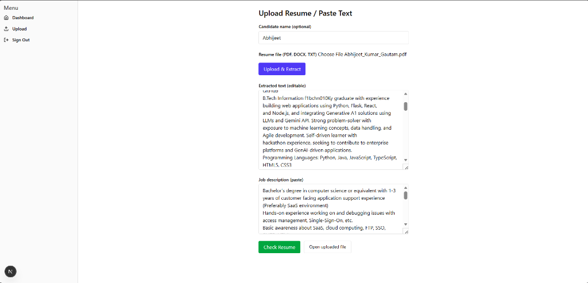

# ATS - Applicant Tracking System (Supabase & Gemini AI)

A modern Applicant Tracking System (ATS) built with Next.js, Supabase, and Google Gemini AI. This tool helps recruiters and hiring managers efficiently parse resumes, extract key information, and score candidates against job descriptions using advanced AI.

## 🚀 Features

- **Resume Parsing**: Automatically extract text from PDF, DOCX, and TXT files.
- **AI-Powered Analysis**: Leverages Google Gemini AI to analyze candidate's skills and experience.
- **Resume-Job Match Scoring**: Calculate a match percentage between a resume and a job description.
- **Interactive Dashboard**: View and manage candidate results at a glance.
- **Editable Extracted Text**: Fine-tune the extracted resume text before analysis.
- **Secure Authentication**: Built-in authentication powered by Supabase.

## 🛠️ Tech Stack

- **Framework**: [Next.js 15 (App Router)](https://nextjs.org/)
- **Backend/Database**: [Supabase](https://supabase.com/)
- **AI Engine**: [Google Generative AI (Gemini)](https://ai.google.dev/)
- **UI Components**: [Radix UI](https://www.radix-ui.com/), [Lucide React](https://lucide.dev/), [Tailwind CSS](https://tailwindcss.com/)
- **File Processing**: `pdf-parse`, `mammoth`, `unpdf`
- **Language**: [TypeScript](https://www.typescriptlang.org/)

## 📸 Screenshots

### Dashboard - Resume Results
View all processed resumes with their AI-generated scores and summaries.


### Upload & Extract
Easy resume upload with real-time text extraction and editing capabilities.


### Resume Matching
Compare the candidate's profile against a specific job description for precise matching.


## 🚦 Getting Started

### Prerequisites

- Node.js installed
- A Supabase account and project
- A Google AI (Gemini) API key

### Installation

1. Clone the repository:
   ```bash
   git clone <repository-url>
   cd ats-supabase
   ```

2. Install dependencies:
   ```bash
   npm install
   ```

3. Set up environment variables:
   Create a `.env.local` file in the root directory and add your credentials:
   ```env
   NEXT_PUBLIC_SUPABASE_URL=your_supabase_url
   NEXT_PUBLIC_SUPABASE_ANON_KEY=your_supabase_anon_key
   GEMINI_API_KEY=your_gemini_api_key
   ```

4. Run the development server:
   ```bash
   npm run dev
   ```

Open [http://localhost:3000](http://localhost:3000) with your browser to see the result.

